# Deep Learning Accent Classification Project

## Project Overview

This project implements deep learning models for **accent classification** from audio recordings. The task involves classifying audio samples into 5 different accent categories using both raw waveform and spectrogram-based approaches.

### Objective
- **Task**: Multi-class classification of accents from audio recordings
- **Classes**: 5 accent categories (labeled 1-5)
- **Input**: Audio files (.wav format, 7 seconds duration)
- **Output**: Predicted accent class for each audio sample

### Dataset Structure
- **Training Data**: Located in `Dataset_2025/Train/`
- **Test Data**: Located in `Test set/`
- **Audio Format**: 16kHz sampling rate, 7-second duration (112,000 samples)
- **File Naming Convention**: `{class}{gender}_{id}.wav` (e.g., `1f_1018.wav`, `2m_1044.wav`)
  - First digit: Accent class (1-5)
  - Second character: Gender (f/m for female/male)
  - Number: Unique identifier

## Workflow Visualization

```mermaid
flowchart TD
    A[Raw Audio Dataset<br/>Dataset_2025/Train/] --> B{Data Augmentation}
    B --> C[Time Shifting<br/>±10% duration]
    B --> D[Volume Changes<br/>±3dB gain]
    B --> E[Speed Changes<br/>0.9x to 1.1x]
    
    C --> F[Augmented Dataset<br/>Dataset_2025_augmented/]
    D --> F
    E --> F
    
    F --> G{Model Path Selection}
    A --> G
    
    G --> H[Model A Path<br/>Raw Waveform]
    G --> I[Model B Path<br/>Spectrogram]
    
    %% Model A Path
    H --> J[Load Audio Files<br/>torchaudio.load]
    J --> K[Pad/Trim to 7s<br/>112,000 samples]
    K --> L[Train/Val Split<br/>80/20]
    L --> M[RawWaveformCNN<br/>1D CNN Architecture]
    
    %% Model B Path
    I --> N[Mel-Spectrogram<br/>Preprocessing]
    N --> O[FFT: 1024<br/>Hop: 256<br/>Mel bins: 64]
    O --> P[Amplitude to dB<br/>Log scale conversion]
    P --> Q[Save as .pt files<br/>mel_specs/]
    Q --> R[Create Metadata CSV<br/>mel_metadata.csv]
    R --> S[Train/Val Split<br/>80/20 stratified]
    S --> T[SpectrogramCNN<br/>2D CNN Architecture]
    
    %% Training Process
    M --> U[Training Loop<br/>Adam Optimizer]
    T --> V[Training Loop<br/>Adam Optimizer]
    
    U --> W[Model A Training<br/>lr=1e-3, wd=1e-5]
    V --> X[Model B Training<br/>lr=1e-3, wd=2e-6]
    
    W --> Y[Early Stopping<br/>Validation Accuracy]
    X --> Z[Early Stopping<br/>Patience=16 epochs]
    
    Y --> AA[Save Best Model<br/>best_model.pt]
    Z --> BB[Save Best Model<br/>best_model_b*.pt]
    
    %% Model Variants
    BB --> CC[Model B<br/>Base Version]
    BB --> DD[Model B2<br/>Optimized Version]
    BB --> EE[Model B3<br/>Alternative Version]
    
    %% Evaluation Phase
    AA --> FF[Test Set Evaluation]
    CC --> FF
    DD --> FF
    EE --> FF
    
    FF --> GG[Load Test Data<br/>Test set/]
    GG --> HH{Model Type}
    
    HH --> II[Raw Audio Processing<br/>Model A]
    HH --> JJ[Spectrogram Processing<br/>Model B variants]
    
    II --> KK[Inference<br/>Batch Prediction]
    JJ --> KK
    
    KK --> LL[Generate Predictions<br/>submission_*.csv]
    
    %% Results Analysis
    LL --> MM[Performance Analysis]
    MM --> NN[Confusion Matrix<br/>confusion_matrix_*.png]
    MM --> OO[Accuracy by Gender<br/>accuracy_by_sex_*.png]
    MM --> PP[Accuracy by Group<br/>accuracy_by_group_*.png]
    MM --> QQ[Detailed Predictions<br/>detailed_predictions_*.csv]
    
    %% Final Results
    NN --> RR[Results Summary<br/>results.txt]
    OO --> RR
    PP --> RR
    QQ --> RR
    
    RR --> SS[Model A: 67.3%<br/>Model B: 96.0%<br/>Model B2: 96.7%<br/>Model B3: 96.1%]
    
    %% Styling
    classDef dataNode fill:#e1f5fe,stroke:#01579b,stroke-width:2px
    classDef processNode fill:#f3e5f5,stroke:#4a148c,stroke-width:2px
    classDef modelNode fill:#e8f5e8,stroke:#1b5e20,stroke-width:2px
    classDef resultNode fill:#fff3e0,stroke:#e65100,stroke-width:2px
    
    class A,F,GG dataNode
    class B,C,D,E,J,K,N,O,P,U,V,W,X,Y,Z processNode
    class M,T,AA,BB,CC,DD,EE modelNode
    class LL,MM,NN,OO,PP,QQ,RR,SS resultNode
```



## Project Architecture

### Model Approaches

#### **Model A: Raw Waveform CNN**
- **Architecture**: 1D Convolutional Neural Network
- **Input**: Raw audio waveform (112,000 samples)
- **Features**:
  - 1D convolutions with kernel sizes optimized for audio
  - Batch normalization and dropout for regularization
  - Max pooling for dimensionality reduction
  - Fully connected classifier

#### **Model B: Spectrogram CNN (Multiple Variants)**
- **Architecture**: 2D Convolutional Neural Network
- **Input**: Log-Mel spectrograms (64 mel bins)
- **Preprocessing**: 
  - Mel-spectrogram transformation (n_fft=1024, hop_length=256)
  - Amplitude to dB conversion
- **Features**:
  - 2D convolutions for spatial feature extraction
  - Self-attention mechanism (optional)
  - Adaptive pooling for consistent output dimensions

### Data Augmentation
The project implements comprehensive audio augmentation techniques:
- **Time Shifting**: Random temporal shifts (±10% of duration)
- **Volume Changes**: Random gain adjustments (±3dB)
- **Speed Changes**: Random speed variations (0.9x to 1.1x)

## File Structure

```
deep_learning/
├── Dataset_2025/              # Original training data (gitignored)
├── Dataset_2025_augmented/    # Augmented training data (gitignored)
├── Test set/                  # Test data (gitignored)
├── mel_specs/                 # Precomputed spectrograms (gitignored)
├── mel_specs_augmented/       # Augmented spectrograms (gitignored)
├── results_modelA/            # Model A evaluation results
├── results_modelB/            # Model B evaluation results
├── results_modelB2/           # Model B variant 2 results
├── results_modelB3/           # Model B variant 3 results
├── modelA.ipynb              # Raw waveform CNN implementation
├── modelB_spectrogram.ipynb  # Spectrogram CNN implementation
├── mel_metadata.csv          # Original spectrogram metadata
├── mel_metadata_augmented.csv # Augmented spectrogram metadata
├── mel_metadata_hop.csv      # Alternative hop length metadata
├── submission_*.csv          # Model predictions on test set
├── results.txt               # Summary of model performance
└── best_model*.pt            # Trained model weights (gitignored)
```

## Getting Started

### Prerequisites
```bash
pip install torch torchaudio pandas scikit-learn matplotlib seaborn
```

### Required Libraries
- **PyTorch**: Deep learning framework
- **torchaudio**: Audio processing and transformations
- **pandas**: Data manipulation and CSV handling
- **scikit-learn**: Train/validation splitting and metrics
- **matplotlib/seaborn**: Visualization and plotting

### Data Preparation
1. Place training audio files in `Dataset_2025/Train/`
2. Place test audio files in `Test set/`
3. Run data augmentation (optional but recommended)
4. Generate spectrograms for Model B variants

## Model Implementation Details

### Model A: Raw Waveform CNN
```python
class RawWaveformCNN(nn.Module):
    - Input: [batch_size, 1, 112000]
    - Conv1d layers with increasing channels: 1→64→128→256
    - Kernel sizes: 80, 3, 3 with appropriate strides
    - BatchNorm + ReLU + MaxPool1d
    - Fully connected: flattened_size → 512 → 5 classes
```

### Model B: Spectrogram CNN
```python
class SpectrogramCNN(nn.Module):
    - Input: [batch_size, 1, 64, time_frames]
    - Conv2d layers: 1→32→64→128→256 channels
    - Self-attention mechanism (optional)
    - Adaptive pooling to [4, 4]
    - Fully connected: 256×4×4 → 512 → 5 classes
```

## Results Summary

| Model | Test Accuracy | Description |
|-------|---------------|-------------|
| Model A | 67.3% | Raw waveform CNN |
| Model B | 96.0% | Spectrogram CNN (base) |
| Model B2 | 96.7% | Spectrogram CNN (optimized) |
| Model B3 | 96.1% | Spectrogram CNN (variant) |

### Key Findings
- **Spectrogram-based models significantly outperform raw waveform approach**
- **Model B2 achieves the best performance at 96.7% accuracy**
- **Data augmentation proves crucial for model generalization**
- **Mel-spectrogram preprocessing captures essential acoustic features effectively**

## Evaluation Metrics

Each model generates comprehensive evaluation reports including:
- **Overall accuracy** on test set
- **Confusion matrices** showing per-class performance
- **Accuracy by gender** (male vs female speakers)
- **Accuracy by accent group** breakdown
- **Detailed predictions** with metadata for error analysis

### Visualization Outputs
- `confusion_matrix_model*.png`: Class-wise prediction accuracy
- `accuracy_by_sex_model*.png`: Gender-based performance analysis
- `accuracy_by_group_model*.png`: Accent group performance
- `accuracy_by_group_sex_model*.png`: Combined gender-accent analysis

## Training Process

### Model A Training
1. Load augmented audio files directly
2. Apply padding/trimming to 7-second duration
3. Train with Adam optimizer (lr=1e-3, weight_decay=1e-5)
4. Early stopping based on validation accuracy

### Model B Training
1. Precompute mel-spectrograms for faster training
2. Load spectrograms from `.pt` files
3. Train with Adam optimizer (lr=1e-3, weight_decay=2e-6)
4. Early stopping with patience=16 epochs

### Training Configuration
- **Batch Size**: 16-32 (depending on model)
- **Train/Validation Split**: 80/20
- **Loss Function**: CrossEntropyLoss
- **Optimizer**: Adam with weight decay
- **Device**: CUDA if available, CPU fallback

## Usage Instructions

### Training a Model
```python
# For Model A (Raw Waveform)
python modelA.ipynb  # Run all cells in Jupyter

# For Model B (Spectrogram)
python modelB_spectrogram.ipynb  # Run all cells in Jupyter
```

### Making Predictions
```python
# Load trained model and run inference
model = SpectrogramCNN(num_classes=5)
model.load_state_dict(torch.load('best_model_b2.pt'))
# Run prediction pipeline
```

### Evaluation
Each model automatically generates:
- Submission CSV files for test set predictions
- Detailed evaluation reports with visualizations
- Performance metrics saved to results directories

## Audio Processing Pipeline

### Preprocessing Steps
1. **Load Audio**: Using torchaudio with soundfile backend
2. **Normalize Duration**: Pad or trim to exactly 7 seconds
3. **Feature Extraction**:
   - Model A: Use raw waveform directly
   - Model B: Convert to mel-spectrogram → log scale
4. **Augmentation**: Apply time/frequency domain augmentations
5. **Batching**: Prepare for model input

### Spectrogram Configuration
- **Sample Rate**: 16kHz
- **FFT Size**: 1024
- **Hop Length**: 256 samples
- **Mel Bins**: 64
- **Window**: Hann window (default)

## Model Comparison

| Aspect | Model A (Waveform) | Model B (Spectrogram) |
|--------|-------------------|----------------------|
| **Input Type** | Raw audio samples | Log-mel spectrograms |
| **Preprocessing** | Minimal (pad/trim) | Mel-spectrogram + dB |
| **Architecture** | 1D CNN | 2D CNN |
| **Training Speed** | Slower | Faster (precomputed) |
| **Memory Usage** | Higher | Lower |
| **Performance** | 67.3% | 96.0-96.7% |
| **Interpretability** | Lower | Higher |

## Future Improvements

### Potential Enhancements
1. **Advanced Architectures**: 
   - Transformer-based models (Wav2Vec2, Whisper)
   - ResNet/DenseNet backbones for spectrograms
2. **Feature Engineering**:
   - MFCC features
   - Chroma features
   - Spectral contrast
3. **Ensemble Methods**: Combine multiple model predictions
4. **Advanced Augmentation**: SpecAugment, mixup techniques
5. **Transfer Learning**: Pre-trained audio models

### Known Limitations
- Fixed 7-second duration requirement
- Limited to 5 accent classes
- Requires significant computational resources for training
- Model A performance gap suggests need for architecture improvements

## License

This project is developed for educational/research purposes. Please ensure proper attribution when using or modifying the code.

## Contributing

Contributions are welcome! Please feel free to submit pull requests or open issues for:
- Bug fixes
- Performance improvements
- New model architectures
- Enhanced evaluation metrics
- Documentation improvements

---

**Note**: Model weights and datasets are excluded from version control due to size constraints. Ensure you have the required data files before running the training scripts. 